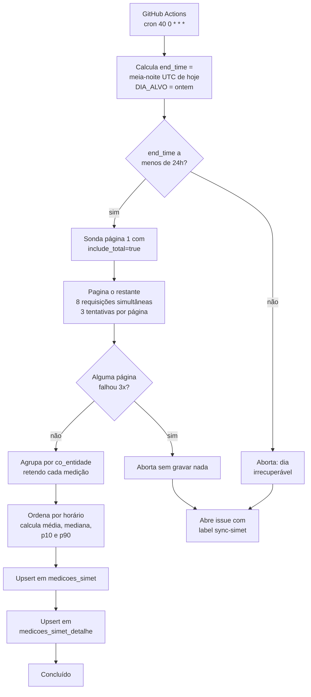

# Medições SIMET — estrutura, fluxo e operação

Documentação técnica da sincronização diária das medições de conectividade das escolas
(SIMET/NIC.br) para o Supabase.

- [O que o sistema faz](#o-que-o-sistema-faz)
- [Estrutura de dados](#estrutura-de-dados)
- [O campo `medicoes`](#o-campo-medicoes)
- [Fluxo de execução](#fluxo-de-execução)
- [Como consultar](#como-consultar)
- [Decisões de arquitetura](#decisões-de-arquitetura)
- [Operação](#operação)
- [Armadilhas](#armadilhas)

---

## O que o sistema faz

Todo dia, um job lê da API pública do SIMET as medições de velocidade feitas nas escolas
nas últimas 24 horas, agrega por escola e grava no Supabase.

O volume de entrada é grande e o de saída é pequeno:

```
~520.000 medições brutas  ──agregação──>  ~80.000 linhas
   (521 páginas da API)                   (uma por escola/dia)
```

Cada escola mede várias vezes por dia — 6 vezes na mediana, até 189 no caso extremo. O job
condensa essas medições em **uma única linha por escola e dia**, com as estatísticas do dia,
e preserva as medições individuais num campo JSON.

**Por que isso é urgente todo dia:** a API do SIMET só serve as últimas 24 horas. Não existe
backfill. Um dia que o job não coletar está perdido em definitivo.

---

## Estrutura de dados

São duas tabelas, ambas com a mesma chave primária `(co_entidade, dia)` e ambas com
**uma linha por escola/dia**.

```
┌─────────────────────────────────────┐        ┌──────────────────────────────┐
│ medicoes_simet                      │        │ medicoes_simet_detalhe       │
│ ─────────────────────────────────── │        │ ──────────────────────────── │
│ PK (co_entidade, dia)               │ 1───1  │ PK (co_entidade, dia)        │
│                                     │        │                              │
│ identificação: nome_provedor, tipo, │        │ medicoes  jsonb              │
│   agent_id, asn                     │        │   (as medições individuais)  │
│ total_medicoes                      │        │                              │
│ media_*      (6 métricas)           │        │ retenção: 180 dias           │
│ mediana_/p10_/p90_  (3 métricas)    │        │ ~750 bytes/linha             │
│                                     │        │                              │
│ retenção: para sempre               │        │                              │
│ 233 bytes/linha                     │        │                              │
└─────────────────────────────────────┘        └──────────────────────────────┘
   lida por 16 views e matviews                  lida só por quem quer o detalhe
```

### `medicoes_simet` — os agregados

| Coluna | Tipo | Observação |
|---|---|---|
| `co_entidade` | `bigint` | código INEP da escola (PK) |
| `dia` | `date` | dia **UTC** da medição (PK) |
| `nome_provedor`, `tipo`, `agent_id`, `asn` | `text`/`bigint` | vêm da medição mais recente do dia |
| `total_medicoes` | `integer` | quantas medições válidas a escola teve no dia |
| `media_download_mbps` | `numeric` | média aritmética simples |
| `media_upload_mbps` | `numeric` | |
| `media_latencia_ms` | `numeric` | |
| `media_perda_pacote` | `numeric` | percentual |
| `media_jitter_upload_ms` | `numeric` | |
| `media_jitter_download_ms` | `numeric` | |
| `mediana_` / `p10_` / `p90_` `download_mbps` | `numeric` | 3 colunas |
| `mediana_` / `p10_` / `p90_` `upload_mbps` | `numeric` | 3 colunas |
| `mediana_` / `p10_` / `p90_` `latencia_ms` | `numeric` | 3 colunas |

Jitter e perda de pacote **não** têm percentil em coluna. Essas colunas nunca expiram e as
6 métricas custariam ~5 GB/ano; os percentis delas continuam calculáveis a partir do detalhe
enquanto ele existir (180 dias).

### `medicoes_simet_detalhe` — as medições individuais

| Coluna | Tipo |
|---|---|
| `co_entidade` | `bigint` (PK) |
| `dia` | `date` (PK) |
| `medicoes` | `jsonb` |

Índice adicional em `dia`, porque a PK começa por `co_entidade` e não serve para filtrar
por data — que é o que a purga e as consultas de um dia fazem.

---

## O campo `medicoes`

Sete **séries paralelas** alinhadas por índice: o item `i` de cada série pertence à mesma
medição.

```json
{
  "h":  ["23:44:15", "23:58:47"],
  "d":  [205.1322,   204.8209],
  "u":  [43.2284,    44.725],
  "l":  [28.118,     35.128],
  "p":  [0,          0],
  "ju": [0.54,       0.77],
  "jd": [0.15,       0.21]
}
```

| Chave | Significado | Unidade |
|---|---|---|
| `h` | horário da medição, `HH:MM:SS` (a data está na coluna `dia`) | UTC |
| `d` | download | Mbps |
| `u` | upload | Mbps |
| `l` | latência | ms |
| `p` | perda de pacote | % |
| `ju` | jitter de upload | ms |
| `jd` | jitter de download | ms |

Garantias do formato:

- **Todas as séries têm o mesmo comprimento**, igual a `total_medicoes` na tabela agregada.
- **Ordenado por horário**, crescente. Isso torna a linha reproduzível: duas execuções da
  mesma janela produzem bytes idênticos.
- **Valores exatamente como a API devolveu.** Ela entrega no máximo 4 casas decimais, então
  não há arredondamento nem perda. Só as estatísticas derivadas (média, mediana, percentis)
  são arredondadas em 4 casas.
- Uma métrica ausente numa medição entra como `null`, preservando o alinhamento dos índices.

> **Ausência de linha em `medicoes_simet_detalhe` não significa "escola sem medições".**
> Significa detalhe purgado (>180 dias) ou dia anterior à criação da tabela. Para saber se
> houve medição, use `total_medicoes` na tabela agregada.

---

## Fluxo de execução



### Detalhando cada etapa

**1. Janela de tempo.** O `end_time` é fixado na **meia-noite UTC do dia da execução**, e o
`DIA_ALVO` é o dia anterior. Como a janela da API é `[end_time - 24h, end_time)`, isso
devolve exatamente um dia UTC fechado.

O `end_time` é calculado uma vez e reusado em todas as páginas. Sem isso a janela
deslizaria durante os ~30 min de coleta e os registros trocariam de página.

**2. Paginação.** A API responde HTTP 500 sem paginação (o volume passou do que ela
serializa de uma vez). São ~521 páginas de 1000 registros, buscadas com **8 requisições
simultâneas**. Cada página tem 3 tentativas com backoff crescente.

Se alguma página esgotar as tentativas, **o job aborta sem gravar nada** — um dia com
páginas faltando produziria médias silenciosamente erradas, o que é pior que não ter o dia.

**3. Filtros.** Uma medição é descartada se:
- não tiver `vel_download_mbps` **ou** `vel_upload_mbps` (~2,3% dos registros);
- não pertencer ao `DIA_ALVO` (trava de segurança — com o `end_time` alinhado à meia-noite
  isso nunca acontece, mas impede que uma janela deslocada sobrescreva outro dia).

**4. Agregação.** As medições são retidas em memória, agrupadas por `(co_entidade, dia)`.
Custa ~119 MB de heap para o dia inteiro, contra os 16 GB do runner.

Cada métrica tem o **próprio n**: uma latência nula não encolhe a amostra de download nem
contamina a média dele.

**5. Estatísticas.** Percentil pelo método **R-7** (interpolação linear), que é exatamente o
que `percentile_cont` do PostgreSQL faz — então dá para conferir qualquer coluna rodando
`percentile_cont` sobre o próprio JSON.

**6. Gravação.** Upsert nas duas tabelas com `onConflict: "co_entidade,dia"`, em lotes
fechados por **orçamento de bytes** (~1 MB, teto de 250 linhas) em vez de número fixo de
linhas — porque uma escola pode pesar 59 KB e outra 400 bytes.

A tabela agregada vai primeiro. Se o detalhe falhar depois, o dia continua correto para quem
lê médias e percentis; basta reexecutar para completar.

### Números de referência

Uma execução real (30/09/2026, dia alvo 29/09):

```
Total de medições: 520.543 em 521 páginas
Coleta: 32 min  ·  Gravação: ~110s
Medições válidas: 508.657  |  sem download/upload: 11.886
Escolas únicas: 80.155  |  máx. numa escola: 189
```

Distribuição de medições por escola: **p50 = 6**, p90 = 12, p99 = 21, máximo 189.
**37,2% das escolas medem menos de 5 vezes por dia**; 4.379 medem só uma vez.

---

## Como consultar

### Agregados de um dia

```sql
select co_entidade, total_medicoes,
       media_download_mbps, mediana_download_mbps,
       p10_download_mbps, p90_download_mbps
from medicoes_simet
where dia = current_date - 1;
```

### Agregados **com** o detalhe

Use `left join` — dia purgado ou anterior à migração não tem detalhe:

```sql
select a.*, d.medicoes
from medicoes_simet a
left join medicoes_simet_detalhe d using (co_entidade, dia)
where a.dia = current_date - 1;
```

### Expandir o detalhe em linhas

Para reconstruir as medições individuais de uma escola:

```sql
select (d.medicoes->'h'->>i)           as horario,
       (d.medicoes->'d'->>i)::numeric  as download_mbps,
       (d.medicoes->'u'->>i)::numeric  as upload_mbps,
       (d.medicoes->'l'->>i)::numeric  as latencia_ms
from medicoes_simet_detalhe d,
     generate_series(0, jsonb_array_length(d.medicoes->'h') - 1) i
where d.co_entidade = 42089263 and d.dia = '2026-09-29'
order by 1;
```

### Recalcular uma estatística a partir do detalhe

Útil para jitter e perda, que não têm coluna de percentil:

```sql
select co_entidade,
       percentile_cont(0.5) within group (order by v::numeric) as mediana_jitter_upload
from medicoes_simet_detalhe d,
     jsonb_array_elements_text(d.medicoes->'ju') v
where d.dia = current_date - 1
group by co_entidade;
```

### A view `vw_vectra_simet_24h`

É a view consumida via API por cliente externo. Cobre **só o dia anterior** e renomeia as
colunas para o vocabulário da API do SIMET (`media_download_mbps` → `vel_download_mbps`).

Ela expõe o detalhe na coluna **`medicoes`**, adicionada no fim para não deslocar as
colunas existentes. O join é `left join`: escola sem detalhe continua aparecendo, com
`medicoes` nulo.

> **Cuidado com o desempenho.** A view tem `row_number() over (order by dia desc,
> co_entidade)` gerando a coluna `id`. Uma window function obriga o PostgreSQL a
> materializar e ordenar **todas as 80 mil linhas com o JSON** antes de devolver a primeira,
> então `limit` não ajuda:
>
> | Consulta com `limit 1000` | Tempo | Sort em disco |
> |---|---|---|
> | Com `row_number()` (a view) | **471 ms** | 70 MB |
> | Sem `row_number()` | **5,6 ms** | — |
>
> São **84× de diferença**, e o custo é do `row_number()`, não do join com o detalhe. O
> problema já existia (173 ms antes, com 14 MB de sort); o JSON o amplificou. Se o cliente
> paginar com `offset`, cada página paga os 471 ms.
>
> A coluna `id` daí não é um identificador estável — ela é recalculada a cada consulta e
> muda quando os dados mudam. Trocá-la por `co_entidade` (já único dentro do dia) eliminaria
> o custo, mas **altera o contrato com o cliente** e precisa ser combinado com ele.

### Ao usar percentis em análises

**Filtre por `total_medicoes >= 5`.** Com 37% das escolas abaixo disso, e 4.379 com uma única
medição, nesses casos `media = mediana = p10 = p90` — correto matematicamente, mas sem
conteúdo estatístico. Um `avg(p90_download_mbps)` sobre todas as escolas não se sustenta.

```sql
select avg(p90_download_mbps)
from medicoes_simet
where dia = current_date - 1
  and total_medicoes >= 5;   -- <-- necessário
```

---

## Decisões de arquitetura

### Por que o detalhe fica em tabela separada

A primeira versão colocava o `jsonb` como coluna de `medicoes_simet`. Medição sobre 20 mil
linhas mostrou que isso sai caro:

| | jsonb na tabela principal | tabela separada |
|---|---|---|
| Bytes por linha (principal) | 745 | **157** |
| Agregação típica de matview | 1111 ms | **154 ms** |
| Páginas varridas | 1819 | **512** |
| Consulta **com** detalhe (1 dia) | 11 ms | 20 ms |

O motivo é que **16 views e materialized views leem só os agregados** — incluindo 3 matviews
com `REFRESH` diário. Com o JSON inline, elas arrastariam ~590 bytes por linha para nunca
usá-los.

O trade-off é favorável: quem precisa do detalhe paga **+9 ms** por dia consultado; tudo que
não precisa fica **7,2× mais rápido**.

> **O TOAST não resolve isso.** A saída natural seria o PostgreSQL mover o JSON para a tabela
> TOAST, mas ele só é acionado acima de ~2 KB por tupla, e as linhas ficavam em ~745 bytes —
> logo abaixo do gatilho. Testado: nem `toast_tuple_target = 128` nem `storage external`
> mudam isso.

### Por que uma linha por escola, e não uma por medição

Uma linha por medição seriam ~508 mil linhas por dia (185 milhões por ano), contra 80 mil.
Todas as views, dashboards e o consumo via API assumem o grão de uma linha por escola/dia.
O JSON preserva o dado granular sem mudar esse grão.

### Por que reter as medições em memória

A versão anterior acumulava só soma e contagem, sem guardar os valores. Mediana e percentil
exigem os valores individuais. A medição mostrou que reter o dia inteiro custa **119 MB de
heap** e que ordenar todos os arrays leva **0,1 s** — irrelevante contra 32 min de coleta.

### Custo de armazenamento

O JSON ocupa **`103 + n × 96` bytes**, onde `n` é o número de medições:

| n | jsonb |
|---|---|
| 1 | 199 B |
| 6 | 684 B |
| 19 | 1.934 B |

Com a média de 6,35 medições por escola: ~750 bytes/linha → **~60 MB/dia**, estabilizando em
**~10,8 GB** com a retenção de 180 dias. A tabela agregada passou de 157 para 233 bytes/linha,
custo das 9 colunas de percentil.

---

## Operação

### Agendamento

GitHub Actions, cron `40 0 * * *` (00:40 UTC = 21:40 de Brasília), logo após o dia UTC fechar.
Também aceita execução manual pela aba Actions (`workflow_dispatch`).

**O cron do Actions é "não antes de", não um horário.** Atrasos de 1 a 6 horas são normais e
variáveis. Isso **não corrompe dados**: o `end_time` deriva da meia-noite UTC, não do relógio
do runner, então um atraso de 6h coleta exatamente o mesmo dia. O que o atraso consome é a
margem da janela de 24h — que nunca chegou perto de acabar.

### Variáveis de ambiente

| Variável | Efeito |
|---|---|
| `SUPABASE_URL`, `SUPABASE_KEY` | credenciais (secrets do repositório) |
| `SIMET_DRY_RUN=1` | coleta e agrega, imprime um exemplo e **não grava** |
| `SIMET_MAX_PAGINAS=N` | para depois de N páginas; use junto com o dry-run |
| `SIMET_END_TIME` | sobrescreve o `end_time`; recupera o dia anterior |
| `SIMET_TABELA` | grava em outra tabela; o detalhe vai para `<valor>_detalhe` |

```powershell
# inspeção rápida, sem gravar
$env:SIMET_DRY_RUN = "1"; $env:SIMET_MAX_PAGINAS = "6"; node sync.mjs
```

### Recuperação de falha

O job falhando abre uma issue com a label `sync-simet` (ou comenta na já aberta, para uma
sequência de falhas não virar enxurrada).

**A janela de recuperação é de um dia só.** Enquanto a meia-noite alvo estiver a menos de
24h, basta rodar o workflow manualmente. Passado isso, não há backfill — os dados somem.

Reexecutar é sempre seguro: o upsert é idempotente sobre o mesmo `end_time`.

### Retenção

O detalhe é purgado aos 180 dias por um job mensal do `pg_cron`
([sql/002](../sql/002_retencao_detalhe_180d.sql)). Os agregados **nunca** são apagados.

### Arquivos

| Arquivo | Papel |
|---|---|
| [sync.mjs](../sync.mjs) | o job inteiro |
| [.github/workflows/sync.yml](../.github/workflows/sync.yml) | agendamento e alerta de falha |
| [sql/000](../sql/000_estrutura_antes_20260930.sql) | estrutura da tabela antes da mudança |
| [sql/001](../sql/001_detalhe_e_percentis.sql) | migração do detalhe e dos percentis |
| [sql/002](../sql/002_retencao_detalhe_180d.sql) | rotina de retenção |
| [sql/003](../sql/003_vw_vectra_expor_medicoes.sql) | view do cliente expondo o detalhe |

Não há `package.json`, build, lint nem testes. A dependência `@supabase/supabase-js` é
instalada pelo workflow antes de rodar o script. Node 22, ESM, `fetch` nativo.

---

## Armadilhas

**Os horários e o campo `dia` são UTC, não Brasília.** O dia UTC vira às 21:00 BRT. Uma
análise que assuma horário local vai errar por 3 horas.

**A paginação da API não é perfeitamente estável.** Duas coletas com o mesmo `end_time`
podem devolver alguns registros a mais ou a menos — o `OFFSET` do backend não tem ordenação
determinística por baixo. O desvio medido é de ~0,01%. O job avisa no log quando o total
recebido diverge do anunciado, mas não aborta: a amostra continua representativa.

**Percentis em `n` par podem diferir de `percentile_cont` em 0,0001.** Com `n` ímpar a
mediana é um valor existente na série e bate exato; com `n` par ela é a média dos dois
centrais, e o `float64` do JavaScript arredonda a 4ª casa para lado diferente do `numeric`
do PostgreSQL. Medido: 413 casos em 30.927 (1,3%), todos de exatamente 0,0001 — 0,1 kbps.
É ruído de arredondamento, não erro.

**Adicionar um campo ao objeto gravado exige criar a coluna antes.** As chaves do objeto são
exatamente as colunas da tabela; uma chave sem coluna faz o lote inteiro falhar. Depois de
criar a coluna, o cache de schema do PostgREST ainda pode servir o schema antigo — um
`notify pgrst, 'reload schema'` resolve.

**Não há transação entre os lotes.** Um erro no meio deixa os lotes anteriores gravados.
Não é um problema na prática porque o upsert é idempotente, mas significa que uma falha
parcial deixa o dia incompleto até a reexecução.

**Média e mediana discordam bastante em escolas com oscilação.** É o motivo de existir a
mediana: numa escola real com 19 medições, a média de download foi 554 Mbps e a mediana
645 Mbps — a diferença vem de medições degradadas (19,5 Mbps) que puxam a média para baixo.
Para fiscalizar SLA, a mediana e o p10 dizem mais.

---

## Ponto em aberto

**A role `anon` tem `INSERT`, `UPDATE`, `DELETE` e `TRUNCATE` nas duas tabelas, e não há RLS.**
Como a chave `anon` é pública por design, na prática qualquer um que a possua pode alterar ou
apagar os dados que alimentam a API consumida por clientes externos.

Isso é anterior a esta implementação e a tabela de detalhe herdou o mesmo perfil ao ser criada.
A correção mínima seria revogar `DELETE`, `TRUNCATE` e `UPDATE` de `anon`, mantendo `SELECT` —
mas é preciso verificar antes quais integrações escrevem nessas tabelas.
